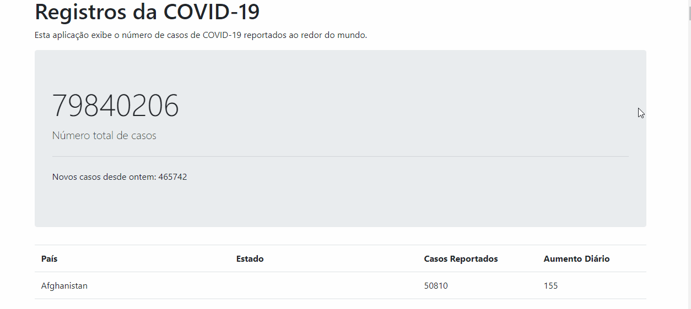

<h1 align="center">Coronavirus Tracker</h1>

 Sistema desenvolvido com Spring Boot

## Sobre
App desenvolvido com Spring Boot para apresentar dados diários de contágio por COVID-19

## Tabela de conteúdos
<!--ts-->
   * [Sobre](#sobre)
   * [Tabela de Conteúdos](#tabela-de-conteúdos)
   * [Features](#features)
   * [Tecnologias](#-tecnologias)
   * [Pré-requisitos](#pré-requisitos)
   * [Rodando a aplicação](#rodando-a-aplicação)  
<!--te-->

### 🛠 Tecnologias
Para a construção deste projeto, foram utilizadas as seguintes ferramentas:
- [Spring Boot](https://spring.io/projects/spring-boot)
- [JUniy 5](https://junit.org/junit5/docs/current/user-guide/#overview)
- [Java 12](https://www.oracle.com/br/java/technologies/javase/jdk12-archive-downloads.html)

### Pré-requisitos
Antes de começar, você precisará ter instalado em sua máquina as seguintes ferramentas:
* Git (https://git-scm.com/book/en/v2/Getting-Started-Installing-Git)
* SDK do Java 12 (https://www.oracle.com/br/java/technologies/javase/jdk12-archive-downloads.html)

### Rodando a aplicação
Para instalar e rodar o projeto em sua máquina, siga os seguintes passos;
* Rode o comando "git clone 'url-do-repositorio'" na sua máquina local
* Execute o projeto "mvn spring-boot:run"

Demonstração:
